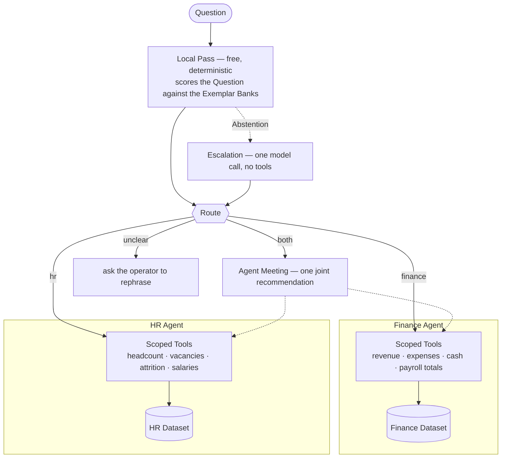

# Two Specialist Agents behind a deterministic Router

Business Questions arrive in one inbox and belong to two domains that must not
mix. "What did we spend on payroll?" is a money Question; "what does Priya
Raman earn?" is a people Question; and whoever can answer the first must not be
able to answer the second. One agent with access to everything would answer both
and quietly destroy that boundary. Two agents with a human deciding which one to
ask is not a system.



Read that picture for what is missing: no edge from one agent into the other's
Scoped Tools, no shared Dataset beneath them, nothing that widens during an Agent
Meeting. That absence *is* the isolation guarantee — wiring, not a filter that has
to be got right at runtime. Every figure in every answer is checked by the
**Number Audit** against the tool results behind it, and the whole thing runs with
no API key and no spend, because **Replay Mode** is the default and serves
**Fixtures** recorded from real **Live Mode** calls.

```
Question: How much cash is left in the bank?

Route:    finance   (Local Pass)
Agent:    Finance Agent

As of September 30, 2025, Cherry Host has **$1,248,000** in the bank. With a monthly net burn of $96,000, that gives a runway of approximately **13 months** at the current rate.

…
```

## Running it, with no key and no spend

```bash
npm install
npm run demo
```

**The first run downloads about 25MB.** The Local Pass uses a local embedding
model (`Xenova/all-MiniLM-L6-v2`, quantized), fetched once into `.model-cache/`
and reused from disk. It is announced on stderr while it happens, and it is the
only network access any default run makes.

`npm run demo` runs the seven demo Questions through the same entry point you
would use yourself. Between them they cover all four Routes, both Router stages,
an out-of-domain refusal, an Agent Meeting, and a Number Audit failure —
`src/demo.ts` says what each Question is there to show. Ask one at a time with:

```bash
npm run ask -- "What does Priya Raman earn?"
```

In Replay Mode the answerable Questions are the recorded ones, which is the demo
set; anything else stops with a Fixture miss naming the record command. A miss is
a hard error rather than a quiet call to the API, because falling through to the
live API and inventing an answer are the two ways a replay layer stops being
evidence of anything (`fixtures/README.md`, ADR 0001). The tests run on this same
path, so the suite is free and offline too: `npm test` and `npm run typecheck`.

## Live Mode, and what it costs

Live Mode takes two things — the `--live` flag and an `ANTHROPIC_API_KEY` in the
environment. Neither half alone gets there, which is what stops a test run or a
casual invocation from spending:

```bash
ANTHROPIC_API_KEY=sk-... npm run ask -- --live "How much cash is left in the bank?"
```

The flag without a key stops the run and says so. A key in the environment of
someone who did not pass the flag arms nothing, and the run says that on stderr
rather than failing.

The project runs under a hard **$5** cap on a personal account. Recording the
whole demo set was 16 calls and cost **$0.1172**, about 2.3% of it;
`docs/recording-pass.md` carries the bill, including the first pass that was
discarded. Recording is the only sanctioned spend and is a separate command, so
an ordinary run cannot drift into it:

```bash
ANTHROPIC_API_KEY=sk-... npm run record -- --demo
```

## The architecture, and why

Three decisions carry this system. The rest — the `LLMClient` seam, the Fixture
keying, the Agent Meeting — are in the repository map with the ADR that argues
each. The general case behind all of them, at eight agents rather than two, is in
[`docs/written-answers.md`](docs/written-answers.md).

### The Router, in two stages

The Router maps a Question to a Route without answering it. Asking a model costs
a round-trip on every Question and gives a non-deterministic answer to a decision
that has to be testable. So the **Local Pass** runs first: it embeds the Question
locally and scores it by maximum cosine similarity against three **Exemplar
Banks** (`finance`, `hr`, `both`). Two named thresholds in
`src/router/thresholds.ts` carry the hard cases — a score floor below which the
Local Pass abstains, and a top-two margin below which the Question is
cross-cutting and the Route is `both`.

A Question it cannot place is not refused. The **Abstention** triggers
**Escalation**: one model call, no tools, no history, returning one of the same
three Routes or `unclear`. The ordering is the whole design — the common case
stays free and deterministic, and both spend and non-determinism are confined to
exactly the Questions a purely local Router would have failed outright. An
Abstention never reaches the operator; `unclear` is a Route only Escalation can
return, and `LocalRoute` in `src/domain/route.ts` makes confusing the two a type
error. Escalation is always on, and ADR 0005 argues why there is no flag to turn
it off.

Routing is tuned by editing data — a phrasing in `src/router/exemplar-banks/`, or
a threshold — never by editing Router logic;
[`docs/exemplar-bank-coverage.md`](docs/exemplar-bank-coverage.md) records what
the Banks cover, what they deliberately do not, and what each decision cost.

### Isolation by Scoped Tools, not by filtering

Each Specialist Agent owns a Dataset and is handed only its own Scoped Tools. The
Finance Agent cannot reach an individual salary because the HR Agent holds the
tool that exposes one; its payroll tool returns a company-wide total and the
headcount it covers, because that is the only shape it can return.

The claim is about wiring, so it is checkable by reading, in four places:
`src/agents/finance/tools.ts` and `src/agents/hr/tools.ts` each end with the
agent's whole tool set as a literal array; `src/agents/specialist-agent.ts` hands
the model `agent.tools` and executes from that same list, with no registry to
look another tool up in; each Dataset is imported by its own tools and nothing
else, both deep-frozen (`src/agents/deep-freeze.ts`); and `src/agents/meeting.ts`
calls the same loop with the same tool sets.

The tests assert that shape rather than a filter's behaviour, because there is no
filter: `src/agents/isolation.test.ts` asserts the two agents share no tool
instance and no tool name. ADR 0004 decides it; written answer 1 has the
alternative that was rejected and why.

### The Number Audit

An agent writing prose about numbers will eventually state a figure that came
from nowhere, and in a finance answer that is not cosmetic. So every figure in an
answer must appear in the Scoped Tool results it was built from. One that does
not is named, and the answer is marked unaudited rather than shown as though it
passed.

The audit checks provenance, not arithmetic: a figure the agent computed is a
figure no tool returned, which is precisely what it is for. A percentage passes
only if a tool returned it — so some correct answers are marked unaudited, a cost
paid knowingly (ADR 0006, written answer 2). The demo shows the audit failing on
purpose: the recorded Agent Meeting states an operating loss and a payroll
percentage no Scoped Tool returned, and re-recording until a clean sample came
back would demonstrate the prompt instead of the check.

## What a run tells you

Every run reports the Route, the stage that decided it, who answered, the answer,
the Number Audit's verdict, and the per-bank scores. Here is a Question the
Exemplar Banks do not cover, rescued by Escalation:

```
Question: When did Ben Carter start?

Route:    hr        (Escalation)
Agent:    HR Agent

Ben Carter, a Junior Engineer on the Engineering team, started on **February 3, 2025** (per records as of September 30, 2025).

Number Audit: passed — every figure in the answer above appears in a Scoped Tool result.

Similarity scores by Exemplar Bank:
  hr      0.336
  finance 0.217
  both    0.170

The Local Pass abstained — nothing cleared the 0.4 score floor —
so this Question went to Escalation, which is the only routing step that spends.
```

Five words, most of them a name the embedding model has never met, so there is
little sentence frame left to match on. One small call places it and the HR Agent
answers it anyway.

## Limitations

Two of these are properties a reviewer would otherwise meet as bugs.

**The Router's vocabulary is only as good as its Exemplar Banks.** An
unanticipated phrasing does not misroute — it abstains and escalates, which costs
one model call and usually produces the right Route. The uncomfortable half of
that trade: a thin Exemplar Bank shows up as **spend rather than as a visible
misroute**, so the failure mode got quieter, not smaller. `npm run survey`
measures the Abstention rate over a realistic day's Questions, which currently
sits at 21%. It is not meant to reach zero — a Question no Dataset answers is
supposed to escalate.

**Ambiguous Questions are no longer free.** The Local Pass is deterministic and
costs nothing; Escalation is neither, and is the only routing step that spends. An
earlier design promised vague input would cost nothing, and ADR 0005 records
withdrawing that promise deliberately. Verdicts are not cached, so the same
unplaceable Question escalates every time. Beyond those two:

- **The embedding model is English-only.** A French Question scores 0.193 against
  its best Bank — the wrong model, not a thin Bank.
- **A misroute degrades rather than lying.** "Who won the customer of the year
  award?" lands on the HR Agent, which holds no tool for it and says so. Still a
  wasted turn.
- **A Number Audit failure does not suppress the answer**, because a system that
  swallows its own bad output teaches nobody anything.
- **Datasets are hardcoded JSON.** There is no database, by design.

## Adding a third Specialist Agent

Four pieces of data and one line of wiring — the HR Agent arrived as exactly this
and no more, touching neither the agent runtime, the Router logic, nor the seam:

1. A **Dataset**: hardcoded JSON plus a typed reader, like
   `src/agents/hr/dataset.ts`, deep-frozen so a tool result cannot be edited on
   its way to the Number Audit.
2. A set of **Scoped Tools** over that Dataset alone, exported as one array, like
   `src/agents/hr/tools.ts`. The array is the isolation guarantee in literal form.
3. A system **prompt** naming the agent's domain, naming what it cannot see, and
   telling it to decline rather than speculate — the third clause is what turns a
   misroute into a visible refusal.
4. An **Exemplar Bank** of phrasings in `src/router/exemplar-banks/`, with rows
   added to the routing table in `src/router/local-pass.test.ts` first.

Then one line in `AGENT_FOR` in `src/ask.ts`, and a recording pass. One thing a
third agent forces open first: `both` names a pair, and with three domains it no
longer does.

## Next steps, deliberately not built

- **Caching Escalation verdicts.** Worth doing if Escalation becomes common;
  today the cheaper fix is widening a Bank.
- **Feeding Escalation verdicts back into the Exemplar Banks.** Tempting, and it
  would let routing drift without anyone deciding to.
- **A second provider adapter.** The seam is the deliverable; an untested adapter
  is not.
- **Queueing, retries, and rate-limit handling** around the `LLMClient` — written
  answer 3 is the design.
- **Multi-turn conversation**, **multilingual routing**, **persistence, auth, and
  multi-tenancy.** No production concerns are addressed; none were asked for.

## Repository map

| Path | What is in it |
| --- | --- |
| `src/cli.ts`, `src/ask.ts` | The entry point, and the whole system in one function. |
| `src/router/` | The Local Pass, Escalation, the thresholds, and the Exemplar Banks. |
| `src/agents/` | The agent runtime, the two Specialist Agents, their Datasets and Scoped Tools. |
| `src/agents/meeting.ts` | The Agent Meeting: two scoped views combined into one attributable recommendation. ADR 0004. |
| `src/audit/number-audit.ts` | The Number Audit, and the full statement of its rule. |
| `src/llm/client.ts` | The one seam every model call goes through, with the live and replay adapters behind it. ADR 0003. |
| `src/llm/fixtures.ts` | Fixture keying: a digest over the whole request, so a prompt edit invalidates its recordings. ADR 0001. |
| `src/demo.ts`, `src/survey.ts` | The demo Question set; the Abstention survey. |
| `fixtures/` | The recordings Replay Mode serves. |
| `docs/written-answers.md` | The assessment's three written answers. |
| `docs/adr/` | The six decisions, with the options rejected and why. |
| `docs/exemplar-bank-coverage.md`, `docs/recording-pass.md` | What the Banks cover and what that cost; what the Fixtures cost, to four decimal places. |
| `docs/how-this-was-built.md`, `docs/spec.md`, `docs/tickets/` | The nine tickets, their dependency order, and the test that opened each. |

## Commands

| Command | What it does |
| --- | --- |
| `npm run demo` | Runs the demo Question set. Replay Mode: no key, no spend. |
| `npm run ask -- "<Question>"` | Answers one Question. Add `--live` to call the API. |
| `npm run survey` | Reports the Abstention rate — the routing bill — with no calls. |
| `npm run record -- --demo` | Live Mode. Re-records the Fixture set. Spends money. |
| `npm test` | The whole suite, on the replay path. |
| `npm run typecheck` | `tsc --noEmit`. |

---

The departments are themed after the platform's own: the Finance Agent is Noah,
the HR Agent is Eva. The names live in prompts and in prose like this one, and
never in a code identifier — `CONTEXT.md` is the authority on that and on the
rest of the vocabulary this README uses.
