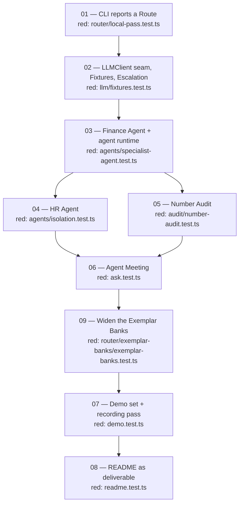

# How this was built

Nine Tickets, each built as a Slice: one failing test that describes the
behaviour, then the smallest code that turns it green, then a review pass. The
Ticket documents in `docs/tickets/` are the ones the work was actually done
from — acceptance criteria and all — and `docs/spec.md` is what they were cut
from. Nothing here was written after the fact.

Three things the tree is worth reading for.

**09 is numbered last and was built seventh.** Ticket files are numbered
append-only, so the number records when the work was *identified*, not when it
ran. Widening the Exemplar Banks had to land before the recording pass in 07,
because Fixtures are keyed by the whole request and a Bank edit changes which
Questions abstain — recording first would have meant paying for the same pass
twice. The dependency, and the reason, are written into ticket 09 itself.

**03 is the fork.** The agent runtime was designed once, under the Finance Agent,
and 04 and 05 both hang off it: the HR Agent reuses the runtime rather than
writing a second loop, and the Number Audit checks the tool results that runtime
retains. 06 needs both and waits for both.

**The review passes are in the history, not the tree.** Five commits are named
`Address code review:` and each follows the Ticket it belongs to — a Slice is not
finished when the test goes green. `git log --oneline` reads in this order.

**Ticket** and **Slice** are defined in `CONTEXT.md` with the rest of the
vocabulary. They name the process rather than the system, so they appear here, in
`docs/tickets/`, and in commit messages — never in code.
